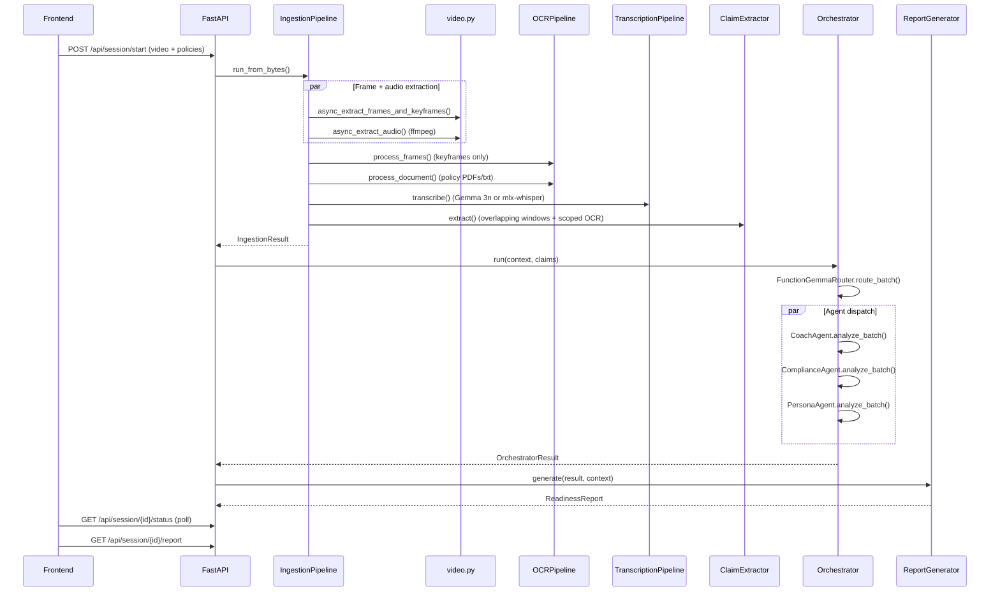

# PitchPilot

> On-device multi-agent pitch rehearsal copilot — powered by Gemma 3n, Gemma 3, and a fine-tuned LoRA router.

PitchPilot analyses a recorded rehearsal and answers one question: **are you ready to demo under scrutiny?**

Three specialised agents run entirely on your machine:
- **Presentation Coach** — evaluates clarity, structure, and narrative flow
- **Compliance Reviewer** — cross-checks claims against your policy documents
- **Audience Persona Simulator** — generates tough questions from stakeholder personas

Two operating modes target different points in the pitch lifecycle:
- **Review mode** — upload a recorded rehearsal for asynchronous analysis
- **Live mode** — get real-time earpiece cues (in-room) or presenter overlays (remote) during a live pitch

---

## Table of Contents

- [Quick Start (Hackathon Demo)](#quick-start-hackathon-demo)
- [Full Local Setup](#full-local-setup)
- [Running the Backend](#running-the-backend)
- [Running the Frontend](#running-the-frontend)
- [Architecture](#architecture)
- [Pipeline Deep Dive](#pipeline-deep-dive)
- [Live Mode](#live-mode)
- [API Reference](#api-reference)
- [Configuration Reference](#configuration-reference)
- [Fine-tuning](#fine-tuning)
- [Testing](#testing)
- [Demo Script (3 minutes)](#demo-script-3-minutes)
- [Project Structure](#project-structure)
- [Troubleshooting](#troubleshooting)
- [Performance Tuning](#performance-tuning)

---

## Quick Start (Hackathon Demo)

The fastest path to a working demo — no models, no Ollama, no file upload needed.

```bash
# 1. Clone and enter the project
cd instalily

# 2. Install Python deps
python3 -m venv .venv && source .venv/bin/activate
pip install fastapi uvicorn[standard] python-multipart pydantic pydantic-settings httpx pytest

# 3. Install frontend deps
cd frontend && npm install && cd ..

# 4. Launch everything
bash scripts/run_demo.sh
```

This starts:
- **Backend** → http://localhost:8000 (demo server with mock pipeline)
- **Frontend** → http://localhost:5173 (React + Vite)
- Opens the browser automatically

In the browser, click **"Load Demo Session"** to skip file upload and see the full analysis view instantly.

### Fast mode (instant results, no stage animation)

```bash
bash scripts/run_demo.sh --fast
```

### Stop all servers

```bash
bash scripts/run_demo.sh --stop
```

---

## Full Local Setup

### Prerequisites

| Requirement | Version | Notes |
|---|---|---|
| Python | 3.11+ | Tested on 3.12 |
| Node.js | 18+ | For the frontend |
| Ollama | latest | Only needed when `GEMMA3N_BACKEND=ollama` |
| Apple Silicon | M1+ | For `mlx-whisper` audio fallback (Ollama mode) |

### Python environment

```bash
python3 -m venv .venv
source .venv/bin/activate       # Windows: .venv\Scripts\activate
pip install -r requirements.txt
```

`requirements.txt` includes: FastAPI, uvicorn, OpenCV, Pillow, numpy, httpx, PyTorch, transformers, accelerate, PEFT, sentencepiece, pypdf, loguru, mlx-whisper (macOS only), and test dependencies.

### Frontend

```bash
cd frontend
npm install
```

### Model backends

PitchPilot supports two backends for multimodal inference. Choose one:

**Option A — HuggingFace Transformers (default)**

Downloads the full Gemma 3n model from HuggingFace. Supports text, image, and native audio input. Requires ~8 GB RAM and a HuggingFace account with Gemma license accepted.

```bash
# Set in .env (this is the default)
PITCHPILOT_GEMMA3N_BACKEND=huggingface
PITCHPILOT_GEMMA3N_HF_MODEL_ID=google/gemma-3n-e4b-it
```

**Option B — Ollama (GGUF)**

Runs quantised models via local Ollama. Supports text and image only — audio transcription falls back to mlx-whisper (Apple Silicon) or returns mock segments.

```bash
PITCHPILOT_GEMMA3N_BACKEND=ollama
ollama pull gemma3n:e4b   # multimodal processing (~4 GB)
ollama pull gemma3:4b      # agent reasoning (~3 GB)
```

### Environment variables

Copy and edit the example env file:

```bash
cp .env.example .env
```

The `.env.local` file takes priority over `.env`. See the [Configuration Reference](#configuration-reference) for the full list.

---

## Running the Backend

### Demo server (always works, no models needed)

```bash
uvicorn backend.demo_server:app --reload --port 8000
```

The demo server returns pre-built fixture data. It:
- Accepts video file uploads (multipart form) and simulates a mock pipeline with progressive stage updates
- Returns rich demo data matching the frontend's expected API shape
- Provides `/api/session/demo` for instant results without uploading
- Provides `/api/session/demo-live` for instant completed live sessions

### Full inference server (requires models)

```bash
uvicorn backend.main:app --reload --port 8000
```

Runs the real multi-agent pipeline. In mock mode (`PITCHPILOT_MOCK_MODE=true`, the default), all model calls return deterministic stubs. Set `PITCHPILOT_MOCK_MODE=false` in `.env.local` and ensure your chosen model backend is available.

The full server also exposes:
- WebSocket endpoint at `/api/session/live` for live sessions
- `/api/readiness` to check whether Ollama and required models are available

### API Documentation

Browse the interactive OpenAPI docs at http://localhost:8000/docs

---

## Running the Frontend

```bash
cd frontend
npm run dev
```

Opens at http://localhost:5173. The Vite dev server proxies `/api/*` to `localhost:8000`.

The frontend has two paths to the results view:

1. **Upload a video** — select a .mp4/.mov/.webm file and click "Start Analysis"
2. **Load Demo Session** — click the button below the main CTA to skip upload and see pre-built results instantly

### Mock vs real backend

The frontend reads the `VITE_USE_MOCK` environment variable (defaults to `true`). When mock mode is active, no backend is required — the frontend replays a mock status sequence and renders canned report data from `src/lib/mock-data.ts`.

To call the real backend:

```bash
# In frontend/.env.local (create if needed)
VITE_USE_MOCK=false
```

---

## Architecture

```
┌───────────────────────────────────────────────────────────────────────┐
│  Inputs                                                               │
│  ┌──────────────┐  ┌───────────────────┐  ┌─────────────────┐        │
│  │ Rehearsal    │  │ Policy / Compliance│  │ Presentation    │        │
│  │ Video (.mp4) │  │ Docs (.txt/.pdf)  │  │ Materials       │        │
│  └──────┬───────┘  └────────┬──────────┘  └───────┬─────────┘        │
│         │                   │                      │                  │
│  ┌──────▼───────────────────▼──────────────────────▼────────────────┐ │
│  │  Ingestion Pipeline                                              │ │
│  │  Frame extraction (OpenCV) · OCR (Gemma 3n) · Transcription      │ │
│  │  Audio: Gemma 3n native (HF) or mlx-whisper fallback (Ollama)    │ │
│  └──────────────────────────┬───────────────────────────────────────┘ │
│                              │                                        │
│  ┌───────────────────────────▼──────────────────────────────────────┐ │
│  │  Claim Extraction — Gemma 3n                                     │ │
│  │  Overlapping transcript windows + scoped OCR → structured claims │ │
│  └──────────────────────────┬───────────────────────────────────────┘ │
│                              │                                        │
│  ┌───────────────────────────▼──────────────────────────────────────┐ │
│  │  Agent Router — rule-based (default) or Gemma 3 1B + LoRA       │ │
│  │  Dispatches claims to: check_compliance, coach_presentation,     │ │
│  │  simulate_persona, tag_timestamp                                 │ │
│  └────────┬──────────────────┬──────────────────┬───────────────────┘ │
│           │                  │                  │                     │
│  ┌────────▼───────┐ ┌───────▼────────┐ ┌───────▼────────────────┐   │
│  │ Coach Agent    │ │Compliance Agent│ │ Persona Simulator      │   │
│  │ (Gemma 3 4B)  │ │ (Gemma 3 4B)  │ │ (Gemma 3 4B)           │   │
│  └────────┬───────┘ └───────┬────────┘ └───────┬────────────────┘   │
│           └─────────────┬───┘                   │                    │
│                         │◄──────────────────────┘                    │
│  ┌──────────────────────▼───────────────────────────────────────────┐ │
│  │  Readiness Report Generator                                      │ │
│  │  Score (0-100) · Grade (A-F) · Findings · Timeline · Priority    │ │
│  └──────────────────────────────────────────────────────────────────┘ │
└───────────────────────────────────────────────────────────────────────┘
```

### Model roles

| Model | Role | Backend | Notes |
|---|---|---|---|
| Gemma 3n E4B | Multimodal processing: OCR, audio transcription, claim extraction | HuggingFace Transformers (text + image + audio) **or** Ollama (text + image only) | Configured via `PITCHPILOT_GEMMA3N_BACKEND` |
| Gemma 3 1B | Agent routing: classifies claims → dispatches to tool functions | HuggingFace Transformers + LoRA adapter | Default: rule-based router from `router_rules.yaml`; model mode requires `ROUTER_USE_RULES=false` |
| Gemma 3 4B | Agent reasoning: coach, compliance, persona analysis | Ollama **or** HuggingFace (delegates to Gemma 3n HF adapter) | Configured via `PITCHPILOT_GEMMA3N_BACKEND` |

### Router modes

The `FunctionGemmaRouter` selects one of two backends:

1. **Rule-based (default, `ROUTER_USE_RULES=true`)** — deterministic claim-type and keyword matching defined in `backend/prompts/router_rules.yaml`. No model inference required. Produces identical routing decisions for the same input.

2. **Model-based (`ROUTER_USE_RULES=false`)** — loads Gemma 3 1B (`google/gemma-3-1b-it`) plus an optional LoRA adapter and parses FunctionGemma-style control tokens (`<start_function_call>fn_name{...}<end_function_call>`). Falls back to rule-based routing if model loading fails or output parsing produces no tool calls.

The router dispatches claims to four tool functions:

| Function | Dispatched to | Purpose |
|---|---|---|
| `check_compliance` | ComplianceAgent | Cross-check claim against policy documents |
| `coach_presentation` | CoachAgent | Evaluate clarity, structure, pacing |
| `simulate_persona` | PersonaAgent | Generate stakeholder questions |
| `tag_timestamp` | (direct) | Annotate the timeline at claim timestamp |

### Readiness scoring

The report generator produces a 0–100 readiness score across four weighted dimensions:

| Dimension | Weight |
|---|---|
| Clarity | 25% |
| Compliance | 30% |
| Defensibility | 25% |
| Persuasiveness | 20% |

Each dimension starts at a content-based floor (50 points) and earns bonus points proportional to the number of claims analysed (up to 15 claims saturates the bonus). Severity penalties then reduce from that ceiling: `info` (−3), `warning` (−8), `critical` (−18). A letter grade (A–F) maps from the final score.

---

## Pipeline Deep Dive

### Review mode data flow



### Frame extraction and keyframe detection

`pipeline/video.py` extracts frames at a configurable FPS rate (`PITCHPILOT_EXTRACTION_FPS`, default 1.0). In a single OpenCV pass it computes the normalised mean-pixel difference between consecutive frames. Frames exceeding the `KEYFRAME_DIFF_THRESHOLD` (default 0.3) are flagged as keyframes. Only keyframes are saved to disk (JPEG at `FRAME_MAX_DIMENSION`); non-keyframes are used only for the diff computation and then discarded.

Audio extraction runs concurrently via ffmpeg in a subprocess, producing a 16 kHz WAV file.

### OCR

`pipeline/ocr.py` sends keyframe images to Gemma 3n for text extraction. A perceptual-hash cache (Hamming distance ≤ 5) deduplicates near-identical frames, skipping redundant LLM calls for repeated slides. Concurrency is bounded by `OCR_CONCURRENCY` (default 2) to avoid saturating the GPU queue. Policy documents (.txt, .md, .pdf via pypdf) are also processed into OCR blocks.

### Transcription

`pipeline/transcribe.py` attempts Gemma 3n native audio transcription first (when using the HuggingFace backend). If that is unavailable (Ollama backend) or fails, it falls back to mlx-whisper (Apple Silicon only). In mock mode, it returns deterministic stub segments.

### Claim extraction

`pipeline/claims.py` builds overlapping transcript windows (sized by `CLAIM_CONTEXT_WINDOW_SECONDS`) and pairs each window with temporally-nearby OCR blocks. Each window is sent to Gemma 3n with the `claim_extraction.txt` prompt. Extracted claims are deduplicated and capped at `MAX_CLAIMS_PER_SESSION` (default 50, 15 in fast mode).

---

## Live Mode

Live mode streams audio and video frames from the user's microphone and camera over a WebSocket to the backend, which runs claim extraction and agent routing incrementally.

### Modes

| Mode | UI | Delivery mechanism |
|---|---|---|
| `live_in_room` | Dark minimal UI (invisible to audience) | Earpiece audio cues via TTS |
| `live_remote` | Split presenter/audience zones | Overlay cards, teleprompter, objection prep sidebar |

### WebSocket protocol

**Endpoint:** `ws://localhost:8000/api/session/live` (only available on `backend.main:app`, not the demo server)

**Client → Server:**

| Type | Format | Description |
|---|---|---|
| `init` | JSON `{"type":"init","mode":"live_in_room","personas":[...],"policy_text":"..."}` | Initialise session |
| `end_session` | JSON `{"type":"end_session"}` | Request finalisation |
| `ping` | JSON `{"type":"ping"}` | Keep-alive |
| Audio chunk | Binary, prefix byte `0x01` | Raw audio data |
| Video frame | Binary, prefix byte `0x02` | JPEG-encoded frame |

**Server → Client:**

| Type | Payload | Description |
|---|---|---|
| `session_created` | `{session_id, mode}` | Session registered |
| `transcript_update` | `{segments}` | Incremental transcript |
| `finding` | `{finding}` | New agent finding |
| `nudge` | `{nudge}` | Soft coaching nudge |
| `earpiece_cue` | `{cue, audio_b64?}` | In-room: text cue + optional TTS audio |
| `overlay_card` | `{card}` | Remote: visual overlay |
| `teleprompter` | `{points}` | Remote: talking point refresh |
| `objection_prep` | `{objections}` | Remote: anticipated objections |
| `script_suggestion` | `{suggestion}` | Remote: script improvement |
| `status` | `{progress, stage}` | Progress update |
| `finalizing` | `{}` | Session ending, building report |
| `session_complete` | `{report}` | Final readiness report |
| `error` | `{message}` | Error during processing |

### Live pipeline internals

`pipeline/live.py` (`LivePipeline`) buffers incoming audio chunks and video frames. Every `LIVE_EXTRACT_INTERVAL` seconds (default 5), it runs transcription, OCR (if a slide change is detected via OCR text diff), claim extraction, and agent routing on the accumulated data. `pipeline/cue_synth.py` (`CueSynthesizer`) converts findings into earpiece cues (in-room) or script suggestions (remote), with rate limiting (`CUE_MIN_INTERVAL`) and deduplication (`CUE_DEDUP_WINDOW`).

TTS for earpiece cues uses one of three backends (configured via `PITCHPILOT_TTS_ENGINE`):
- `prerendered` — pre-recorded WAV clips from `data/cue_bank/`
- `system` — macOS `say` command (default)
- `piper` — Piper ONNX TTS (placeholder)

### Seeding live demo sessions

```bash
# Instant completed live in-room session
curl -s -X POST "http://localhost:8000/api/session/demo-live?mode=live_in_room" | python3 -m json.tool

# Instant completed live remote session
curl -s -X POST "http://localhost:8000/api/session/demo-live?mode=live_remote" | python3 -m json.tool
```

### Registering a pending live session (for WebSocket handshake)

```bash
curl -s -X POST http://localhost:8000/api/session/start-live \
  -H "Content-Type: application/json" \
  -d '{"mode": "live_in_room", "personas": ["Skeptical Investor"], "policy_text": ""}' \
  | python3 -m json.tool
```

Returns `session_id` and `ws_url` for the WebSocket connection.

### Live mode frontend flow (mock)

When `VITE_USE_MOCK` is not `false` (the default):

1. Select **Live In-Room** or **Live Remote** on the SetupPage
2. Click **Start** — the mock session begins immediately (no real microphone needed)
3. Findings and earpiece cues arrive over the mock interval
4. Click **End Session** — the finalizer runs for ~2 seconds then transitions to **Results**
5. `ResultsPage` renders the mode-specific report with the **LIVE IN-ROOM** / **LIVE REMOTE** badge, session duration, and cue count

---

## API Reference

### Demo server (`backend.demo_server:app`)

| Method | Path | Description |
|---|---|---|
| `POST` | `/api/session/start` | Upload video + optional policy docs, start mock analysis |
| `POST` | `/api/session/demo` | Instant demo session (no upload) |
| `POST` | `/api/session/start-live` | Register pending live session |
| `POST` | `/api/session/demo-live` | Instant completed live session (query param `mode`) |
| `GET` | `/api/session/{id}/status` | Poll processing progress (0–100%) |
| `GET` | `/api/session/{id}/report` | Full readiness report |
| `GET` | `/api/session/{id}/timeline` | Timestamped timeline annotations |
| `GET` | `/api/session/{id}/findings` | Agent findings and persona questions |
| `GET` | `/health` | Health check |

### Full server (`backend.main:app`)

All demo server routes plus:

| Method | Path | Description |
|---|---|---|
| `WebSocket` | `/api/session/live` | Live session WebSocket |
| `GET` | `/api/readiness` | Pipeline + Ollama readiness check |

### Frontend API client (`lib/api.ts`)

| Function | Endpoint | Purpose |
|---|---|---|
| `startSession(video, policyDocs, personas, presentationMaterials)` | `POST /api/session/start` | Upload and start analysis |
| `getStatus(sessionId)` | `GET /api/session/{id}/status` | Poll progress |
| `getReport(sessionId)` | `GET /api/session/{id}/report` | Fetch report |
| `getTimeline(sessionId)` | `GET /api/session/{id}/timeline` | Fetch timeline |
| `getFindings(sessionId)` | `GET /api/session/{id}/findings` | Fetch findings |
| `startDemoSession(personas)` | `POST /api/session/demo` | Start demo |
| `getLiveSessionWsUrl()` | — | WebSocket URL for live mode |

---

## Configuration Reference

All settings use the `PITCHPILOT_` prefix and can be set via environment variables or `.env`/`.env.local` files. The `.env.local` file takes priority.

### Core settings

| Variable | Default | Description |
|---|---|---|
| `PITCHPILOT_MOCK_MODE` | `true` | Replace all model calls with deterministic stubs |
| `PITCHPILOT_DEMO_DELAY` | `1.5` | Seconds between demo pipeline stage updates (demo server only) |

### Model backend

| Variable | Default | Description |
|---|---|---|
| `PITCHPILOT_GEMMA3N_BACKEND` | `huggingface` | `huggingface` (text+image+audio) or `ollama` (text+image only) |
| `PITCHPILOT_GEMMA3N_HF_MODEL_ID` | `google/gemma-3n-e4b-it` | HuggingFace model ID for Gemma 3n |
| `PITCHPILOT_OLLAMA_BASE_URL` | `http://localhost:11434` | Ollama REST API URL |
| `PITCHPILOT_GEMMA3N_MODEL` | `gemma3n:e4b` | Ollama model tag for Gemma 3n |
| `PITCHPILOT_GEMMA3_MODEL` | `gemma3:4b` | Ollama model tag for Gemma 3 |
| `PITCHPILOT_OLLAMA_TIMEOUT_SECONDS` | `120` | Per-request Ollama timeout |
| `PITCHPILOT_FUNCTION_GEMMA_MODEL_ID` | `google/gemma-3-1b-it` | Base model for FunctionGemma router |
| `PITCHPILOT_FUNCTION_GEMMA_LORA_PATH` | `None` | Path to fine-tuned LoRA adapter directory |

### Router and fallback

| Variable | Default | Description |
|---|---|---|
| `ROUTER_USE_RULES` | `true` | Use rule-based routing (`true`) or model-based routing (`false`) |
| `AUTO_FALLBACK_TO_MOCK` | `true` | Fall back to mock if model inference fails |

### Video and audio processing

| Variable | Default | Description |
|---|---|---|
| `PITCHPILOT_EXTRACTION_FPS` | `1.0` | Frame sample rate |
| `PITCHPILOT_KEYFRAME_DIFF_THRESHOLD` | `0.3` | Scene-change sensitivity (0–1); lower = more keyframes |
| `PITCHPILOT_FRAME_MAX_DIMENSION` | `1920` | Downscale frames before OCR |
| `PITCHPILOT_FRAME_IMAGE_QUALITY` | `90` | JPEG quality (1–100) |
| `PITCHPILOT_AUDIO_SAMPLE_RATE` | `16000` | Audio sample rate in Hz |
| `PITCHPILOT_WHISPER_MODEL` | `base` | Whisper model size for transcription fallback |

### Performance

| Variable | Default | Description |
|---|---|---|
| `PITCHPILOT_FAST_MODE` | `false` | Trade accuracy for speed: lower FPS, skip persona, cap claims at 15 |
| `PITCHPILOT_OCR_CONCURRENCY` | `2` | Max parallel OCR calls (keep ≤ 2 for Ollama) |
| `PITCHPILOT_AGENT_CONCURRENCY` | `3` | Max parallel agent LLM calls |
| `PITCHPILOT_HF_INFERENCE_TIMEOUT_SECONDS` | `120` | Timeout per HuggingFace model.generate() call |
| `PITCHPILOT_MAX_CLAIMS_PER_SESSION` | `50` | Hard cap on claims extracted |
| `PITCHPILOT_CLAIM_CONTEXT_WINDOW_SECONDS` | `30` | Seconds of transcript context per claim window |
| `PITCHPILOT_RETAIN_ARTIFACTS` | `false` | Keep extracted frames/audio after session |

### Live mode

| Variable | Default | Description |
|---|---|---|
| `PITCHPILOT_LIVE_EXTRACT_INTERVAL_SECONDS` | `5` | How often to run extraction during live session |
| `PITCHPILOT_CUE_MIN_INTERVAL_SECONDS` | `15` | Min gap between earpiece cues |
| `PITCHPILOT_CUE_DEDUP_WINDOW_SECONDS` | `60` | Dedup window for same-category cues |
| `PITCHPILOT_TTS_ENGINE` | `system` | TTS backend: `system` (macOS say), `piper`, `prerendered` |
| `PITCHPILOT_TTS_CUE_BANK_PATH` | `data/cue_bank/` | Pre-rendered earpiece audio clips directory |
| `PITCHPILOT_TELEPROMPTER_UPDATE_INTERVAL` | `20` | Teleprompter refresh interval (seconds) |
| `PITCHPILOT_OBJECTION_PREP_UPDATE_INTERVAL` | `30` | Objection prep refresh interval (seconds) |
| `PITCHPILOT_SLIDE_CHANGE_OCR_DIFF_THRESHOLD` | `0.25` | OCR text diff fraction to trigger slide change |

### Frontend

| Variable | Default | Description |
|---|---|---|
| `VITE_USE_MOCK` | (truthy) | Set to `false` in `frontend/.env.local` to call the real backend |

---

## Fine-tuning

The router's model-based mode uses Gemma 3 1B (`google/gemma-3-1b-it`) with a LoRA adapter fine-tuned on pitch-specific routing examples.

### Training data

`fine_tuning/function_gemma/generate_dataset.py` generates `dataset.jsonl` (~100 examples) mapping pitch intents to five tool functions:

```python
check_compliance(claim, claim_type)    → dispatched to ComplianceAgent
coach_presentation(section_text, ...)  → dispatched to CoachAgent
simulate_persona(claim_context, ...)   → dispatched to PersonaAgent
score_readiness(findings)              → used by report generator
tag_timestamp(timestamp, category)     → timeline annotation
```

### Training

```bash
cd fine_tuning/function_gemma
python train.py
```

Uses Unsloth if available, otherwise PEFT/LoRA. Training config: `MAX_SEQ_LEN=512`, `LORA_RANK=16`, `BATCH_SIZE=4`. Output adapter is written to `fine_tuning/function_gemma/adapter/`.

To activate the trained router:

```bash
ROUTER_USE_RULES=false
PITCHPILOT_FUNCTION_GEMMA_LORA_PATH=./fine_tuning/function_gemma/adapter
```

---

## Testing

```bash
# All tests (mock mode forced via conftest.py)
pytest tests/ -v

# By category
pytest tests/test_smoke.py -v       # imports, schemas, fixtures (< 1s)
pytest tests/test_api.py -v         # HTTP cycle via TestClient
pytest tests/test_video.py -v       # frame/audio extraction on synthetic video
pytest tests/test_ingestion.py -v   # full ingestion pipeline (mock)
pytest tests/test_ocr.py -v         # OCR pipeline (mock)
pytest tests/test_transcribe.py -v  # transcription pipeline (mock)
pytest tests/test_claims.py -v      # claim extraction + dedup (mock)

# Live session tests
pytest tests/test_api.py -v -k "live"
pytest tests/test_smoke.py -v -k "live"
```

### Test coverage

| File | Covers |
|---|---|
| `test_smoke.py` | Imports, config, Pydantic schema validation, demo fixture shapes, live fixture validation (cue_hints, live=true, duration), demo mock data quality, env wiring |
| `test_api.py` | Full HTTP cycle (start → poll → report → timeline → findings), live session registration, demo-live (in-room + remote) full cycles, live report provenance fields, shared endpoint compatibility |
| `test_video.py` | `save_video`, `save_video_file`, `extract_frames_and_keyframes`, keyframe detection, `extract_audio` on synthetic video |
| `test_ingestion.py` | Full `IngestionPipeline` run (mock): metadata, frames, OCR, transcript, claims, policy documents, JSON persistence |
| `test_ocr.py` | `OCRPipeline.process_frames`, `process_document`, `_parse_ocr_json` |
| `test_transcribe.py` | `TranscriptionPipeline.transcribe`, required fields, `_parse_transcript_json` |
| `test_claims.py` | `ClaimExtractor.extract`, deduplication, `combine_text`, `_build_transcript_windows` |

Test fixtures are generated by `tests/fixtures/generate_test_fixtures.py` (synthetic video, silent WAV, sample policy files).

### Seeding demo data

```bash
# Basic — create a demo session and print the ID
python scripts/seed_demo.py

# Wait for completion and print a summary
python scripts/seed_demo.py --poll

# Dump the full report as JSON
python scripts/seed_demo.py --poll --json

# Point at a different server
python scripts/seed_demo.py --base-url http://localhost:9000 --poll
```

---

## Demo Script (3 minutes)

### The meta-demo: PitchPilot analyses your own hackathon pitch

**Act 1 — Review Mode (0:00–1:30)**

1. **(0:00)** "PitchPilot helps teams stress-test pitches before high-stakes audiences. Everything runs on-device — pitches contain confidential material."

2. **(0:30)** Upload a pre-recorded 2-min rehearsal and the sample policy docs in `data/sample_policies/`. Or click **"Load Demo Session"** to skip the upload.

3. **(0:45)** Show the pipeline running: frame extraction → OCR → transcription → claim extraction → routing → agents.

4. **(1:00)** Click the **Compliance** tab: highlight the "fully automated" finding and read the policy reference aloud.

5. **(1:20)** Click a **timeline marker** — the timestamp shows exactly where the issue occurred in the video. Show the **Readiness Score** (72/100) and one **Priority Fix**.

**Act 2 — Live In-Room Mode (1:30–2:15)**

6. **(1:30)** Click **New Session**, select **Live In-Room** on the SetupPage. "Now imagine we're in the meeting room right now."

7. **(1:40)** Click Start. The dark minimal UI appears — designed to be invisible to the audience. Deliver 20 seconds of pitch into the microphone.

8. **(1:55)** Show earpiece cues appearing: **"compliance risk"** → **"slow down"** → **"ROI question likely"**. "Each cue arrived within 5–8 seconds of the problematic statement."

9. **(2:05)** Click **End Session**. The finalizer runs. ResultsPage appears — same quality report, same findings, same timeline. But now see the **LIVE IN-ROOM** badge, **5:22 duration**, **6 cues** panel.

**Act 3 — Close (2:15–2:30)**

10. **(2:15)** "Three modes, one product. Review a recording before the meeting. Get coached during it. Review what happened after. All on-device, all private. This is what real-time persuasion support looks like."

### Showing a completed live session without a real device

```bash
curl -s -X POST "http://localhost:8000/api/session/demo-live?mode=live_in_room" | python3 -m json.tool
# then visit ResultsPage for that session ID
```

---

## Project Structure

```
instalily/
├── README.md
├── requirements.txt
├── .env.example                        # Copy to .env and edit
├── .tool-versions                      # python 3.12.9
├── pytest.ini                          # asyncio_mode = auto
│
├── backend/
│   ├── main.py                         # Full inference server (routes + WebSocket)
│   ├── demo_server.py                  # Demo-only server (mock data, no models)
│   ├── config.py                       # Settings (pydantic-settings, env vars)
│   ├── api_schemas.py                  # Pydantic API models (enums + response types)
│   ├── data_models.py                  # Ingestion pipeline Pydantic models
│   ├── schemas.py                      # Internal dataclass contracts (pipeline ↔ agents)
│   ├── ingestion.py                    # Video ingestion orchestrator
│   ├── live_ws.py                      # WebSocket handler for live sessions
│   ├── models/
│   │   ├── base.py                     # ABC: BaseMultimodalModel, BaseTextModel
│   │   ├── ollama_client.py            # Shared httpx.AsyncClient + retry logic
│   │   ├── gemma3n.py                  # Gemma 3n Ollama adapter (text + image)
│   │   ├── gemma3n_hf.py              # Gemma 3n HuggingFace adapter (text + image + audio)
│   │   ├── gemma3.py                   # Gemma 3 4B adapters (Ollama + HF + mock)
│   │   └── function_gemma.py           # Router: rule-based or Gemma 3 1B + LoRA
│   ├── pipeline/
│   │   ├── video.py                    # Frame extraction, keyframes, audio (ffmpeg)
│   │   ├── transcribe.py              # Transcription (Gemma 3n → mlx-whisper fallback)
│   │   ├── ocr.py                      # Slide OCR with phash cache
│   │   ├── claims.py                   # Claim extraction from transcript + OCR
│   │   ├── live.py                     # LivePipeline (incremental extraction for WS)
│   │   └── cue_synth.py               # Earpiece cue / script suggestion synthesis
│   ├── agents/
│   │   ├── base.py                     # BaseAgent ABC (prompt, parse, mock, concurrency)
│   │   ├── orchestrator.py             # FunctionGemmaRouter → parallel agent dispatch
│   │   ├── coach.py                    # Presentation Coach agent
│   │   ├── compliance.py              # Compliance Reviewer agent
│   │   └── persona.py                  # Audience Persona Simulator
│   ├── reports/
│   │   └── readiness.py                # Report aggregation + weighted scoring
│   ├── services/
│   │   └── tts.py                      # TTS: prerendered clips, macOS say, Piper
│   ├── metrics/                        # SessionMetrics, StageTimer, ConcurrencyLimiter
│   └── prompts/
│       ├── coach_system.txt
│       ├── compliance_system.txt
│       ├── persona_system.txt
│       ├── claim_extraction.txt
│       ├── teleprompter.txt
│       ├── objection_prep.txt
│       └── router_rules.yaml           # Rule-based routing config
│
├── frontend/                           # React 19 + Vite 6 + Tailwind 3.4
│   └── src/
│       ├── App.tsx                     # State-driven routing (landing/setup/analyzing/results/live)
│       ├── hooks/
│       │   ├── useSession.ts           # Review session state machine + polling
│       │   └── useLiveSession.ts       # Live session WebSocket + media capture
│       ├── lib/
│       │   ├── api.ts                  # Typed API client (proxied to :8000)
│       │   ├── utils.ts               # cn(), formatTimestamp(), severityColor()
│       │   ├── export-utils.ts        # JSON/CSV/PDF export
│       │   ├── demo-data.ts           # Static demo fixture (ReadinessReport shape)
│       │   └── mock-data.ts           # Mock status sequence + canned reports
│       ├── pages/
│       │   ├── LandingPage.tsx        # Hero, agent cards, pipeline flip cards
│       │   ├── SetupPage.tsx          # Mode picker, upload, personas, "Load Demo"
│       │   ├── AnalyzingPage.tsx      # Progress bar with pipeline stages
│       │   ├── ResultsPage.tsx        # Video + findings + timeline + export
│       │   ├── LiveSessionPage.tsx    # Generic live session (legacy)
│       │   ├── InRoomModePage.tsx     # Dark minimal UI, earpiece cues, mute/sensitivity
│       │   └── RemoteModePage.tsx     # Teleprompter, overlay cards, objection prep
│       ├── components/
│       │   ├── VideoPlayer.tsx        # HTML5 video with forwardRef handle API
│       │   ├── FindingsPanel.tsx      # Tabbed findings (coach/compliance/persona)
│       │   ├── ReadinessScore.tsx     # SVG dial + dimension bars
│       │   ├── TimelinePanel.tsx      # Interactive timeline strip
│       │   ├── ReportSummary.tsx      # Priority fixes + persona questions
│       │   ├── AnalysisResults.tsx    # Alternative results layout (unused)
│       │   └── Timeline.tsx           # Standalone timeline component
│       └── types/
│           ├── api.ts                 # Types matching current UI components
│           └── index.ts              # Types matching backend api_schemas.py + live types
│
├── data/
│   ├── fixtures/
│   │   ├── demo_session.json          # Pre-built demo readiness report
│   │   ├── live_inroom_session.json   # Live in-room fixture
│   │   └── live_remote_session.json   # Live remote fixture
│   ├── sample_policies/
│   │   ├── enterprise_data_policy.txt
│   │   ├── enterprise_data_policy.md
│   │   ├── approved_messaging_guide.txt
│   │   ├── sales_compliance_policy.txt
│   │   └── sample_policy.txt          # Used by tests
│   ├── cue_bank/
│   │   ├── README.md                  # Cue bank docs
│   │   └── generate_clips.sh          # macOS `say` → AIFF clips (22 phrases)
│   └── sessions/                      # Runtime: per-session working directories
│
├── fine_tuning/
│   └── function_gemma/
│       ├── generate_dataset.py        # Generates ~100 training examples
│       ├── dataset.jsonl              # Training data
│       └── train.py                   # LoRA fine-tuning (Unsloth or PEFT)
│
├── scripts/
│   ├── run_demo.sh                    # One-command demo launcher
│   ├── seed_demo.py                   # Seed demo session via API
│   └── benchmark_session.py           # Pipeline benchmark with timing report
│
└── tests/
    ├── conftest.py                    # Forces PITCHPILOT_MOCK_MODE=true
    ├── test_smoke.py                  # Import + schema + fixture tests
    ├── test_api.py                    # Full HTTP cycle tests (TestClient)
    ├── test_video.py                  # Video pipeline tests
    ├── test_ingestion.py             # Full ingestion pipeline tests
    ├── test_ocr.py                    # OCR pipeline tests
    ├── test_transcribe.py            # Transcription pipeline tests
    ├── test_claims.py                 # Claim extraction tests
    └── fixtures/
        └── generate_test_fixtures.py  # Synthetic test data generator
```

---

## Troubleshooting

### Backend won't start

```bash
# Check for port conflicts
lsof -i :8000

# Check Python version
python3 --version  # needs 3.11+

# Re-install deps
pip install -r requirements.txt --upgrade
```

### Frontend blank or "Cannot connect to backend"

1. Check the backend is running: `curl http://localhost:8000/health`
2. Check Vite's proxy config in `frontend/vite.config.ts` — it proxies `/api` to port 8000
3. Try hard-refreshing the browser (Cmd+Shift+R)
4. Ensure `VITE_USE_MOCK` is not set to `false` if you don't have the backend running

### Demo session takes too long

Set the delay to 0 for instant results:

```bash
PITCHPILOT_DEMO_DELAY=0 uvicorn backend.demo_server:app --port 8000
# or
bash scripts/run_demo.sh --fast
```

### Ollama models not loading (Ollama backend only)

```bash
ollama list                          # check what's pulled
ollama pull gemma3n:e4b              # ~4 GB
ollama pull gemma3:4b                # ~3 GB
curl http://localhost:11434/api/tags # verify Ollama is running
```

### HuggingFace model download issues

Ensure you have accepted the Gemma license on HuggingFace and are logged in:

```bash
pip install huggingface_hub
huggingface-cli login
```

### Pipeline hangs on HuggingFace inference

The `HF_INFERENCE_TIMEOUT_SECONDS` setting (default 120s) cancels stalled model calls. If inference is too slow on CPU, set `AUTO_FALLBACK_TO_MOCK=true` (default) to fall back to mock findings.

---

## Performance Tuning

PitchPilot is optimised for local, on-device inference on Apple Silicon Macs with 16 GB RAM.

### Recommended profiles

**Standard quality (default — 16 GB Mac M2/M3):**
```bash
PITCHPILOT_MOCK_MODE=false
PITCHPILOT_EXTRACTION_FPS=1.0
PITCHPILOT_OCR_CONCURRENCY=2
PITCHPILOT_AGENT_CONCURRENCY=3
PITCHPILOT_FRAME_MAX_DIMENSION=1280
PITCHPILOT_RETAIN_ARTIFACTS=false
```

**Fast mode (~50% faster, slight accuracy tradeoff):**
```bash
PITCHPILOT_MOCK_MODE=false
PITCHPILOT_FAST_MODE=true
PITCHPILOT_FRAME_MAX_DIMENSION=768
PITCHPILOT_OCR_CONCURRENCY=1
PITCHPILOT_WHISPER_MODEL=tiny
```

**Debug / retain artifacts:**
```bash
PITCHPILOT_RETAIN_ARTIFACTS=true
PITCHPILOT_MOCK_MODE=false
```

### Key optimisations

1. **Single-pass frame extraction + keyframe detection** — OpenCV loop computes pixel diff in one pass instead of two, saving one full re-read of all frames from disk.
2. **Only keyframes saved to disk** — non-keyframe frames are used only for diff computation then discarded, reducing disk I/O by 60–90% for static slide decks.
3. **Frame downscaling** — frames are resized to `FRAME_MAX_DIMENSION` before JPEG encoding and OCR, reducing base64 payload and model inference time.
4. **Perceptual hash OCR cache** — near-identical frames (Hamming distance ≤ 5) reuse the previous OCR result, eliminating duplicate LLM calls for repeated slides.
5. **Bounded LLM concurrency** — `OCR_CONCURRENCY` and `AGENT_CONCURRENCY` semaphores prevent unbounded Ollama request queues.
6. **Shared httpx.AsyncClient** — all Ollama calls share one connection-pooled HTTP client with automatic retry (3 attempts, exponential backoff).
7. **`keep_alive=10m`** — sent with every Ollama request to prevent model unloading between pipeline calls.
8. **Scoped OCR text per claim window** — each transcript window only sees temporally-nearby OCR blocks, reducing prompt token count by 40–70%.
9. **`format=json` on all model calls** — eliminates markdown-fence stripping fallback.
10. **Audio + frame extraction in parallel** — ffmpeg audio extraction runs concurrently with frame processing via `asyncio.to_thread()`.
11. **Session artifact cleanup** — extracted frames, audio, and video files are deleted after report generation unless `RETAIN_ARTIFACTS=true`.

### Running the benchmark

```bash
# Mock mode (no models required, measures pipeline overhead only)
python scripts/benchmark_session.py

# Real models, single run
PITCHPILOT_MOCK_MODE=false \
python scripts/benchmark_session.py --video /path/to/rehearsal.mp4

# 3 runs, real models, fast mode
PITCHPILOT_MOCK_MODE=false PITCHPILOT_FAST_MODE=true \
python scripts/benchmark_session.py --video /path/to/rehearsal.mp4 --runs 3

# Keep artifacts for inspection
python scripts/benchmark_session.py --no-cleanup

# Output JSON metrics
python scripts/benchmark_session.py --json
python scripts/benchmark_session.py --out metrics_run1.json
```

### Expected performance on Apple Silicon

| Scenario | Video length | Expected time | Notes |
|---|---|---|---|
| Mock mode | any | 1–3s | Pipeline overhead only, no model calls |
| Fast mode (real models) | 5 min | 60–90s | Persona skipped, fewer OCR calls |
| Standard mode (real models) | 5 min | 90–150s | All agents, 1 fps sampling |
| Standard mode (real models) | 2 min | 40–70s | Short pitch deck |

> **Note:** LLM call latency dominates. At ~4 tok/s for Gemma 3 4B on M2, a single agent call with a 500-token response takes ~7s. Reducing call count is more effective than any other optimisation.
