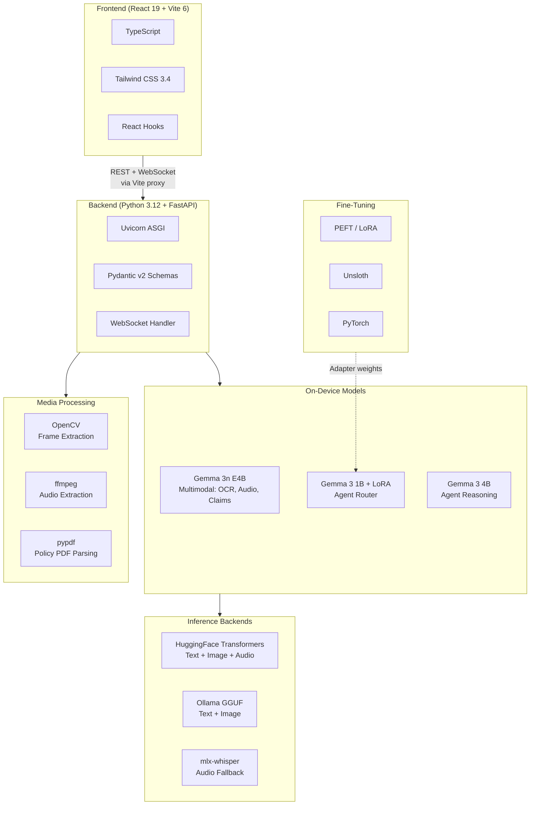
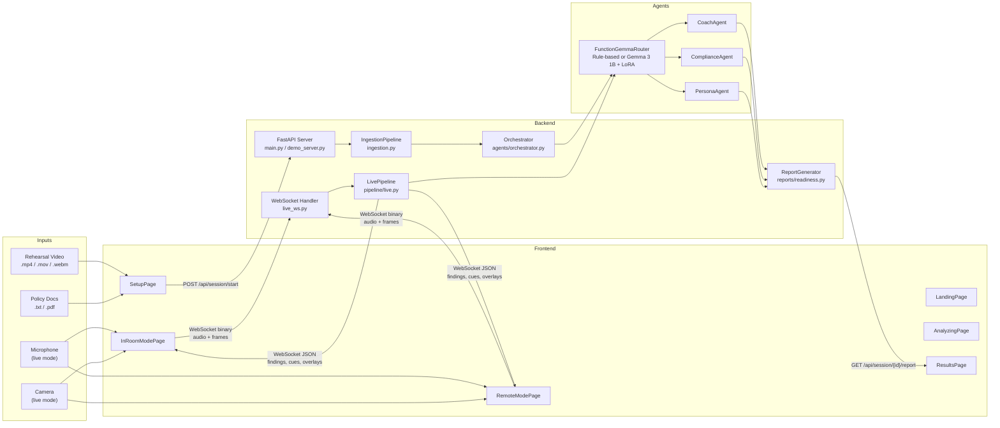
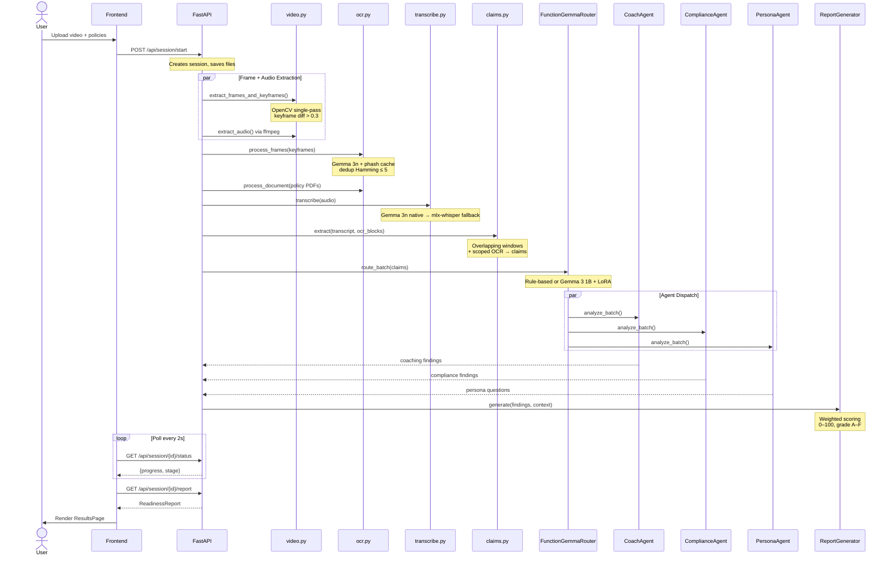
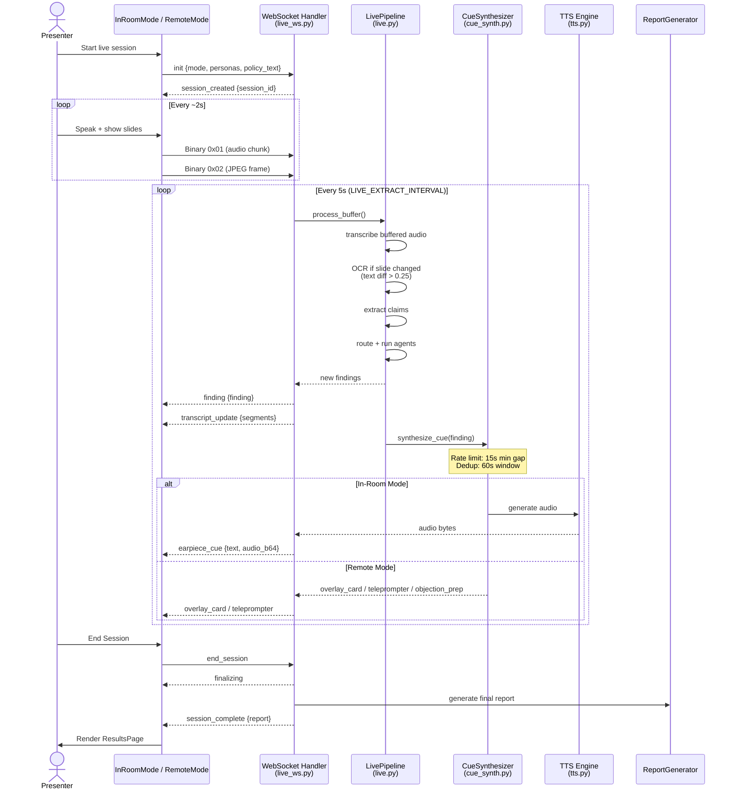
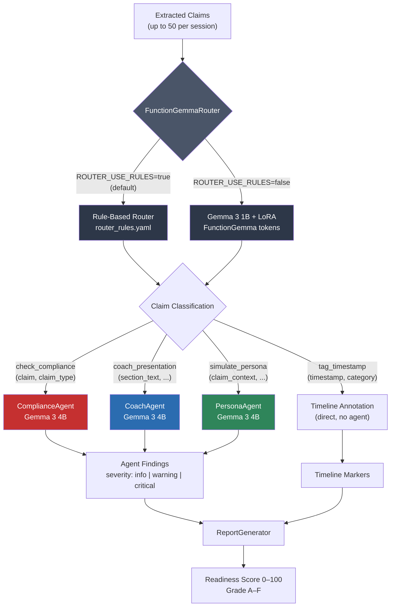
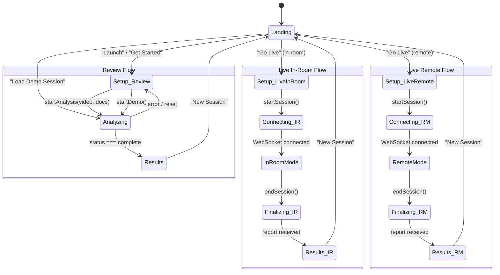
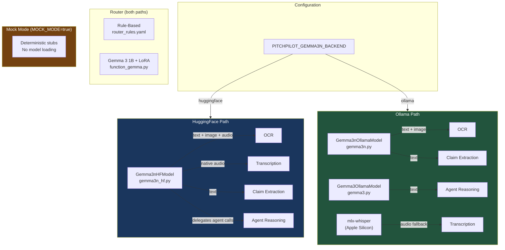
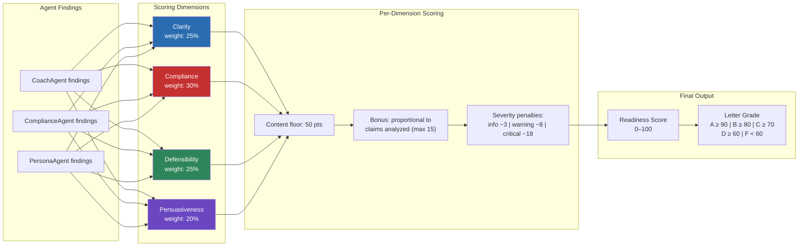

# PitchPilot — Architecture Diagrams & Presentation Scripts

> Seven diagrams covering the full tech stack, system architecture, data pipelines, agent routing, frontend state machine, model inference, and scoring logic.

---

## 1. Tech Stack Overview

---

## 2. High-Level System Architecture

---

## 3. Review Mode Data Flow

---

## 4. Live Mode Pipeline

---

## 5. Agent Router & Dispatch

---

## 6. Frontend State Machine

---

## 7. Model Inference Architecture

---

## 8. Readiness Scoring Breakdown

